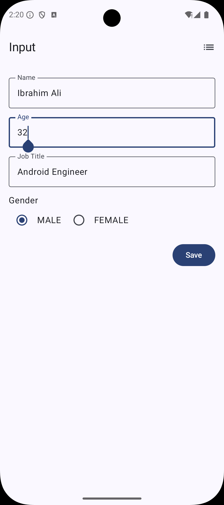
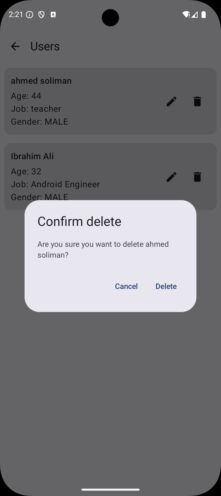
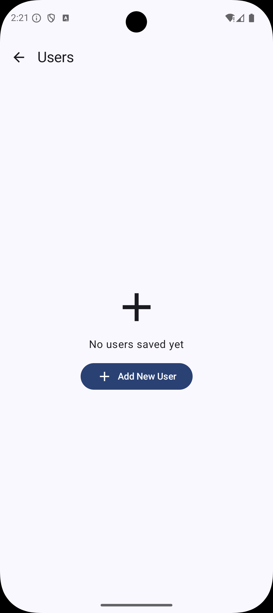

Madarsoft Task (Compose + Room + Hilt)
=====================================

Overview
--------
This sample Android app demonstrates a small single-activity application that lets users add, edit, view and delete simple user records stored locally using Room. The UI is implemented with Jetpack Compose and Navigation Compose, and dependency injection uses Dagger Hilt.

## 🛠️ Tech Stack
- **Language:** [Kotlin](https://kotlinlang.org/)  
- **Asynchronous Programming:** Coroutines & Flows  
- **UI:** [Jetpack Compose](https://developer.android.com/jetpack/compose)  
- **Architecture:** MVVM  
- **Testing:** Unit Tests with JUnit and Coroutines Test  

Key features
------------
- Single-activity architecture (MainActivity) with two screens implemented as Compose destinations (Input + Display).
- Input Screen (Add / Edit user):
  - Single-line inputs for: name, age, job title.
  - Gender selection uses an `enum class Gender` with values MALE and FEMALE (the `OTHER` option was removed).
  - Save creates or updates a record in a local Room database.
  - Supports navigating to the Display screen via a navigation icon.
- Display Screen (List users):
  - Displays all users from the local Room database (ordered by id DESC).
  - Each item shows Edit and Delete icons:
    - Edit navigates back to the Input screen pre-filled for editing and updates the Room DB.
    - Delete shows a confirmation dialog (separate composable) and, on confirmation, removes the record from the DB.
  - Items animate on layout changes using `animateItemPlacement` when an item is removed.
  - Empty state: shows a centered icon and the message "No users saved yet" when there are no users.
  - Floating action / Add new user button navigates to the Input screen.
- Data layer:
  - Room `AppDatabase` with a `User` entity and `UserDao` (suspend functions for insert/update/delete and a `Flow<List<User>>` for all users).
  - `Converters` implemented for the `Gender` enum.
- Dependency Injection: Dagger Hilt is used for wiring the `AppDatabase`, `UserDao`, and the `UserRepository`.
- Tests:
  - Unit tests for ViewModels (example: `DisplayViewModelTest`, `InputViewModelTest`) under `app/src/test`.
  - Instrumentation test added for the local Room database / `UserDao` under `app/src/androidTest` (`UserDaoInstrumentedTest`).

## 📸 Screenshots

